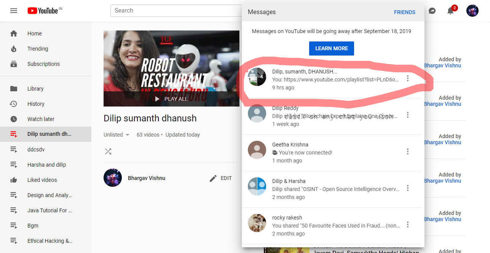
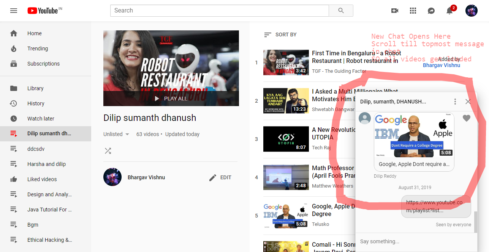
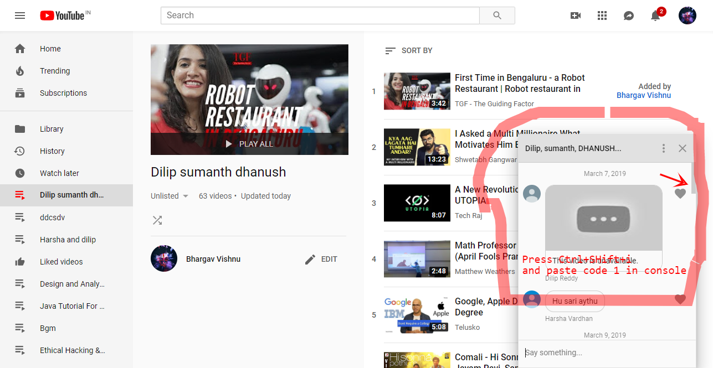
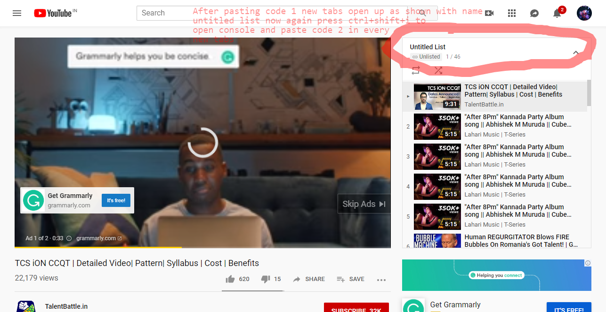
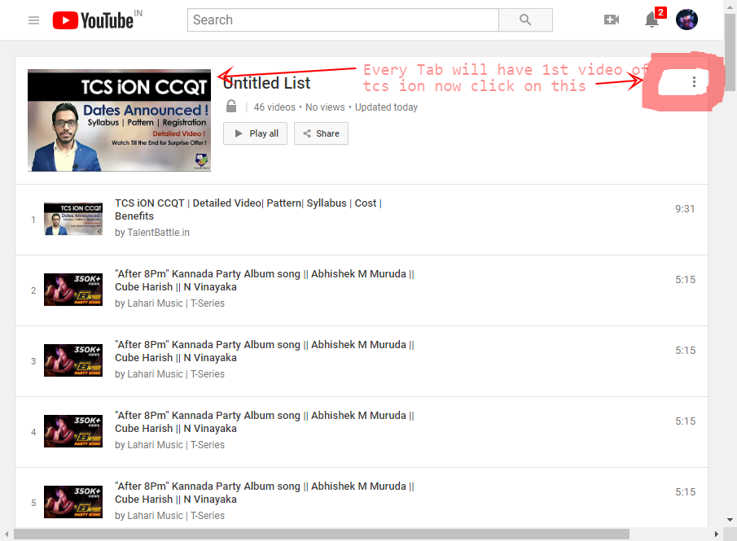
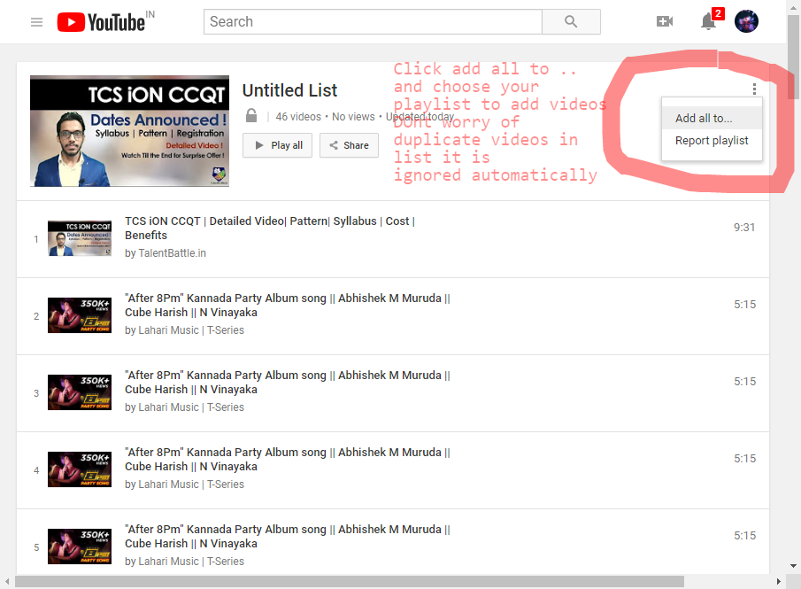
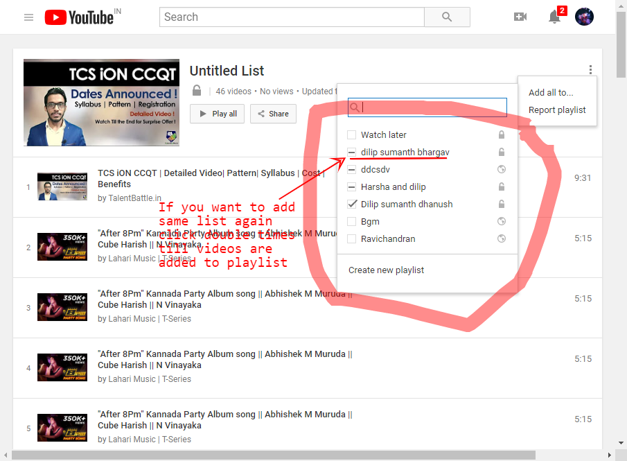

# Youtubechattoplaylist
This code will help you shift your youtube chat to playlist -by BHARGAV VISHNU
Follow these steps to add playlist 
 
 
STEP1: 
Create a new empty private/public playlist then, 
Open a new chat of your choice as shown  
</img>

 
 
STEP2: 
After that scroll to the topmost message in the chat   
</img>

 
 
STEP3: 
Press Ctrl+shift+i to open console and enter below code
 
<pre>
var p=document.getElementsByClassName("style-scope ytd-conversation-video-renderer");
var st='U68cXL9vF4I';
c=0;
for (i=0;i&ltp.length;i++)
{
var p1=p[i].getElementsByTagName("a");
if(p1[0] ){
if(p1[0].id=="thumbnail"){
var s=p1[0].href;
st=st+','+s.slice(32);
c=c+1;
if(c==49){
c=0;
console.log(st);
var hlink="https://www.youtube.com/watch_videos?video_ids="+st
window.open(hlink,'_blank');
st='U68cXL9vF4I';
}
}
}
}
console.log(st);
var dlink="https://www.youtube.com/watch_videos?video_ids="+st
window.open(dlink,'_blank');

---------------------------------------------------------------------------------
</pre>
  
</img>
 
 
STEP4: 
After that New tabs Popup if pop-upis blocked click allow pop-up and repeat step3 again 
All newly opened tabs have first video of tcsion dont worry if duplicate videos are present 
Press Ctrl+shift+i to open console and now insert Code 2 as given below:
 
<pre>
-----------------------------------------------------
var st=document.location.href.slice(49);
document.location.href="https://www.youtube.com/playlist?list="+st+"&disable_polymer=true"
</pre>  
</img>

 
 
STEP5: 
After code 2 is done the tabs reload now click on the : options button on right then click on add to option   
</img>

 
 
STEP6: 
Ignore if duplicate videos its removed from list automatically by youtube
 
  
</img>
 
 
STEP7: 
Select your playlist to add videos ,if there is a - button near playlist click twice  to get added to playlist is displayed on left top 
 
  
</img>

   

